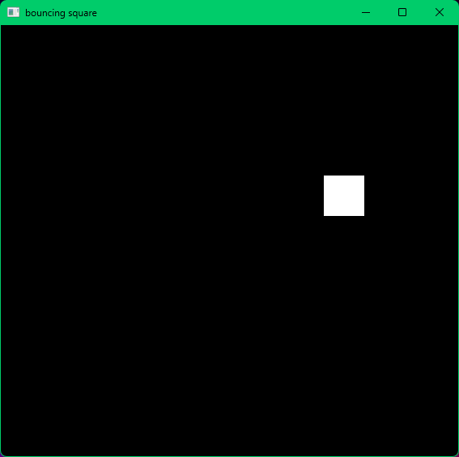

# Bouncing square

## description
This is not a game. It is a program for relaxing that includes a square.

## controls
- To exit click red cross in right upper corner.
- There is not a direct way to influence a square, however you can resize a window to change a trajectory of the square. 

## technical description
- To run .exe file, you need to have an sounds directory (for full high-quality experience), .dll files and .exe file itself in the same directory.
- If you want to try editing it and run through, for example, Clion or Codeblocks, you probably won't succeed, because SDL2 setup is painful, but good luck.
- If you do not like the original mp3 sound, go to sounds directory and change it for other mp3 file. Just make sure it has same name as previous mp3 file.

## warning
- It is not recommended to run this program at night as it might cause a partial or full blindness.
- Program might cause an epilepsy.

## image

